# SigPloit v1 - Kapsamli Kod Inceleme ve Duzeltme Plani

## Yonetici Ozeti

Bu rapor, SigPloit v1 telekomunikasyon guvenlik test framework'unun derinlemesine analizini icerir. Inceleme sonucunda kritik fonksiyonel hatalar, eksik ozellikler ve yeni ozellik onerileri belirlenmistir.

---

## BOLUM 1: KRITIK FONKSIYONEL HATALAR

### 1.1 Firewall Bypass Modulu - ss7/firewall_bypass.py

#### Hata 1.1.1: SCTP Raw Socket IP Header Parsing
- **Dosya:** `ss7/firewall_bypass.py` satir 1242
- **Sorun:** IP header uzunlugu her zaman 20 byte kabul ediliyor ama IP options varsa daha uzun olabilir
- **Mevcut:** `sctp_data = resp[20:] if len(resp) > 32 else resp`
- **Duzeltme:** IHL field'dan gercek header uzunlugu hesaplanmali: `ihl = (resp[0] & 0x0F) * 4`

#### Hata 1.1.2: CRC32c Checksum Byte Order
- **Dosya:** `ss7/firewall_bypass.py` satir 1229-1233
- **Sorun:** SCTP CRC32c checksum little-endian yaziliyor ama RFC 4960'a gore network byte order (big-endian) olmali
- **Duzeltme:** `struct.pack('<I', checksum)` yerine `struct.pack('!I', checksum)` kullanilmali

#### Hata 1.1.3: Fragmentation Bypass Cifte Recv
- **Dosya:** `ss7/firewall_bypass.py` satir 597-601
- **Sorun:** Byte-by-byte fragmentation'da once `_safe_send_recv(sock, b'', timeout)` sonra tekrar `sock.recv(4096)` cagiriliyor - ilk recv response'u tuketiyor, ikinci bos donuyor
- **Duzeltme:** `_safe_send_recv` cagirisi kaldirilmali, sadece `sock.recv(4096)` kullanilmali

#### Hata 1.1.4: Direct SCCP Bypass SCCP Pointer Hatasi
- **Dosya:** `ss7/firewall_bypass.py` satir 768-790
- **Sorun:** SCCP UDT pointer'lari yanlis hesaplaniyor. Called Party ve Calling Party pointer'lari gercek offset'leri gostermeli
- **Duzeltme:** Pointer degerleri dynamic olarak called/calling address uzunluklarina gore hesaplanmali

#### Hata 1.1.5: M2PA Portu Yanlis
- **Dosya:** `ss7/firewall_bypass.py` satir 457
- **Sorun:** M2PA icin port 3565 kullaniliyor ama standart M2PA portu 3565 DEGIL, genellikle 5000-5999 araliginda
- **Duzeltme:** Port listesine 5000, 5001, 5060 eklenmeli

#### Hata 1.1.6: Eksik SCTP COOKIE-ECHO Handshake
- **Dosya:** `ss7/firewall_bypass.py` satir 1090-1188
- **Sorun:** pysctp ile baglanti kurulsa bile M3UA ASP Up gonderilmeden once SCTP association'in tam kurulmasi beklenmiyor
- **Duzeltme:** SCTP 4-way handshake tamamlandiktan sonra M3UA mesajlari gonderilmeli

### 1.2 TCP Transport - ss7/attacks/tcp_transport.py

#### Hata 1.2.1: M3UA ASP Up Handshake Eksik Validation
- **Dosya:** `ss7/attacks/tcp_transport.py` satir 200-241
- **Sorun:** ASP Up Ack response parse edilirken sadece uzunluk kontrolu yapiliyor, M3UA version ve message type dogrulanmiyor
- **Duzeltme:** Response'da `resp[0] == 0x01` (version), `resp[2] == 0x03` (ASPSM), `resp[3] == 0x04` (ASP Up Ack) kontrol edilmeli

#### Hata 1.2.2: TCP Socket Reuse Hatasi
- **Dosya:** `ss7/attacks/tcp_transport.py` satir 367-403
- **Sorun:** `tcp_attack_nohandshake` fonksiyonunda socket kapatilmadan yeni baglanti acilmaya calisiyor
- **Duzeltme:** Her denemede yeni socket olusturulmali

#### Hata 1.2.3: SUA Message Type Yanlis
- **Dosya:** `ss7/attacks/tcp_transport.py` satir 406-453
- **Sorun:** SUA CLDT mesajinda message class 7 (Connectionless) kullanilmali ama 0 kullaniliyor
- **Duzeltme:** `msg_class=7, msg_type=2` (CLDT) olmali

### 1.3 SS7 Protocol Stack

#### Hata 1.3.1: SCCP Address Indicator Yanlis
- **Dosya:** `ss7/attacks/ss7_layers.py` satir 157-184
- **Sorun:** Address Indicator byte'inda Route on GT flag'i (0x40) set edilmeli ama eksik
- **Duzeltme:** `ai = 0x12` yerine `ai = 0x52` (GT + SSN + Route on GT) kullanilmali

#### Hata 1.3.2: TCAP Dialogue Portion Eksik
- **Dosya:** `ss7/attacks/tcap_layer.py` satir 96-117
- **Sorun:** TCAP Begin mesajinda Dialogue Portion (Application Context) eksik - cogu HLR dialogue portion olmadan mesaji reddeder
- **Duzeltme:** MAP Application Context Name eklenmeli (orn: shortMsgGateway-v3 icin `0.4.0.0.1.0.20.3`)

#### Hata 1.3.3: MAP MSISDN Encoding NPI/TON Eksik
- **Dosya:** `ss7/attacks/map_layer.py` satir 149-154
- **Sorun:** MSISDN encoding'de Nature of Address (TON) ve Numbering Plan Indicator (NPI) eklenmeli
- **Duzeltme:** MSISDN byte'inin ilk byte'i `0x91` (International, E.164) olmali

### 1.4 ASN.1 Encoding

#### Hata 1.4.1: Long Form Length Encoding
- **Dosya:** `ss7/attacks/asn1_utils.py` satir 23-32
- **Sorun:** 127'den buyuk length degerlerinde long-form encoding hatali olabilir
- **Duzeltme:** Multi-byte length encoding dogrulanmali

#### Hata 1.4.2: TBCD Encoding Padding
- **Dosya:** `ss7/attacks/asn1_utils.py` satir 114-129
- **Sorun:** Tek haneli numaralarda padding 'F' ekleniyor ama siralama yanlis olabilir
- **Duzeltme:** Son byte'da filler (0xF) high nibble'a konulmali

### 1.5 Diameter Module

#### Hata 1.5.1: AVP Header Yapisi
- **Dosya:** `ss7/attacks/diameter_module.py` satir 103-129
- **Sorun:** AVP header'da flags ve code field'larin sirasi RFC 6733'e uymuyor. AVP Code (4 byte) + Flags (1 byte) + Length (3 byte) olmali
- **Duzeltme:** `struct.pack('!IBxH', code, flags, length)` seklinde yeniden yapilandirilmali

#### Hata 1.5.2: CER Origin-Host/Origin-Realm Encoding
- **Dosya:** `ss7/attacks/diameter_module.py` satir 140-165
- **Sorun:** Origin-Host AVP'de DiameterIdentity type kullanilmali, plain string yerine
- **Duzeltme:** UTF-8 encoding ile dogrudan string gonderimi yeterli ama padding eklenmeli

### 1.6 SIP Module

#### Hata 1.6.1: SIP Via Branch Parametresi
- **Dosya:** `ss7/attacks/sip_module.py` satir 44-65
- **Sorun:** Via header'da branch parametresi RFC 3261'e gore `z9hG4bK` ile baslamali
- **Duzeltme:** Branch generation'da magic cookie prefix eklenmeli

#### Hata 1.6.2: SIP INVITE Flood Thread Safety
- **Dosya:** `ss7/attacks/sip_module.py` satir 474-518
- **Sorun:** INVITE flood'da paylasilan counter'lar (sent, errors) thread-safe degil
- **Duzeltme:** `threading.Lock()` veya `atomic` counter kullanilmali

### 1.7 GTP Module

#### Hata 1.7.1: Python 3 Print Statement Hatasi
- **Dosya:** `gtp/gtp_v2_core/commons/gtp_v2_information_element_base.py` satir 149, 261
- **Sorun:** `print("imsi :"), self.__val` - Python 3'te bu bir tuple olusturur, debug bilgisi yazdirmaz
- **Duzeltme:** `print("imsi :", self.__val)` seklinde duzeltilmeli

---

## BOLUM 2: GENEL KOD KALITE SORUNLARI

### 2.1 Exception Handling (122+ sorunlu satir)
- **Sorun:** Projede 122'den fazla `except Exception:` veya `except:` (bare except) kullanimi var
- **Etkilenen dosyalar:** Tum modullerde
- **Duzeltme:** Her except blogu spesifik exception type yakalamali ve en azindan loglama yapmali

### 2.2 Wildcard Import (31 dosya)
- **Sorun:** `from module import *` kullanimi namespace kirliligine yol aciyor
- **Etkilenen dosyalar:** ss7_layers.py, scapy importlari, socket importlari
- **Duzeltme:** Explicit import kullanilmali

### 2.3 Dongusel Import Riski
- **Sorun:** `ss7/fraud.py`, `ss7/interception.py`, `ss7/tracking.py` dosyalari `sigploit.py` ve `ss7main.py`'i import ediyor, bunlar da birbirini import ediyor
- **Duzeltme:** Menu donusu icin callback pattern kullanilmali

### 2.4 Hardcoded Degerler
- **Sorun:** IP adresleri, port numaralari, point code'lar hardcoded
- **Duzeltme:** Config dosyasindan okunmali

---

## BOLUM 3: EKSIK OZELLIKLER VE EKLENMESI GEREKENLER

### 3.1 Firewall Bypass - Eksik Teknikler

#### 3.1.1 SCTP Multi-Homing Bypass (YENi)
- SCTP'nin multi-homing ozelligi ile farkli source IP'lerden deneme
- Firewall tek IP'yi blokladiginda diger IP'den gecebilir

#### 3.1.2 M3UA Routing Key Management (YENi)
- RKM (Routing Key Management) mesajlari ile routing context olusturma
- Registration Request gondererek yeni routing key kaydettirme

#### 3.1.3 SCCP Management (SCMG) Bypass (YENi)
- SCCP Management mesajlari ile SSN status sorgulama
- Subsystem Test gondererek aktif SSN'leri tespit etme

#### 3.1.4 MAP Version Negotiation (YENi)
- Farkli MAP versiyonlari ile deneme (v1, v2, v3)
- Eski versiyon destekleyen sistemler daha az filtreleme yapar

#### 3.1.5 TLS/DTLS Bypass for Diameter (YENi)
- Diameter over TLS baglantilari icin sertifika dogrulama bypass
- Self-signed sertifika ile baglanti deneme

### 3.2 Attack Modulleri - Eksik Operasyonlar

#### 3.2.1 MAP RegisterSS (YENi)
- Call forwarding ayarlama icin RegisterSS operation
- Unconditional, Busy, No Reply, Not Reachable forwarding

#### 3.2.2 MAP EraseSS (YENi)
- Ayarlanan supplementary service'leri silme
- RegisterSS ile birlikte call forwarding saldirisi tamamlanir

#### 3.2.3 MAP ActivateSS/DeactivateSS (YENi)
- Supplementary service'leri aktif/pasif yapma
- CLIP/CLIR manipulasyonu

#### 3.2.4 MAP CheckIMEI (YENi)
- IMEI dogrulama sorgulama
- Blacklist/Whitelist durumu kontrol

#### 3.2.5 Diameter S6a/S6d Tam Implementasyon (YENi)
- Reset (RSR/RSA) mesajlari
- Notify (NOR/NOA) mesajlari
- Cancel-Location icin farkli cancellation types

#### 3.2.6 GTPv2 Tam Saldiri Seti (YENi)
- Create Session Request Spoofing
- Modify Bearer Request Manipulation
- Delete Session Request DoS

### 3.3 Altyapi Iyilestirmeleri

#### 3.3.1 PCAP Entegrasyonu (MEVCUT - GELISTIRILMELI)
- Her saldiri otomatik PCAP kaydedilmeli
- CaptureContext tum modullere entegre edilmeli

#### 3.3.2 Logging Framework (YENi)
- Python logging modulu ile merkezi log yonetimi
- Seviye bazli loglama (DEBUG, INFO, WARNING, ERROR, CRITICAL)
- Dosya ve konsol handler'lari

#### 3.3.3 Configuration Management (GELISTIRILMELI)
- YAML/JSON bazli konfiguration dosyasi
- Profil bazli saldiri ayarlari (profiles/ dizini zaten var)
- Environment variable destegi

#### 3.3.4 Test Framework (YENi)
- pytest bazli unit testler
- Mock SS7/Diameter server ile integration testler
- Her modulu ayri test edebilme

#### 3.3.5 Plugin Sistemi (YENi)
- Yeni saldiri modulleri plugin olarak eklenebilmeli
- Standart interface ile modullerin register olmasi

---

## BOLUM 4: MODULLERE OZEL DUZELTMELER

### 4.1 ss7/firewall_bypass.py

| Satir | Sorun | Oncelik | Duzeltme |
|-------|-------|---------|----------|
| 184 | `struct.pack('!BBBB I', ...)` - bosluk var | YUKSEK | `struct.pack('!BBBI', ...)` olmali |
| 597 | Cifte recv cagirisi | YUKSEK | Birini kaldir |
| 768-790 | SCCP pointer hesaplama | YUKSEK | Dinamik hesapla |
| 788 | Dialogue portion cok kisa | ORTA | Tam MAP AC ekle |
| 1242 | IP header 20 byte varsayimi | ORTA | IHL'den hesapla |
| 1229 | CRC32c byte order | YUKSEK | Big-endian yap |

### 4.2 ss7/attacks/tcp_transport.py

| Satir | Sorun | Oncelik | Duzeltme |
|-------|-------|---------|----------|
| 200-241 | ASP Up Ack validation eksik | YUKSEK | Message type kontrolu ekle |
| 406-453 | SUA message class yanlis | YUKSEK | Class 7 kullan |
| 384-395 | Socket leak | ORTA | finally blogu ekle |

### 4.3 ss7/attacks/ss7_layers.py

| Satir | Sorun | Oncelik | Duzeltme |
|-------|-------|---------|----------|
| 157-184 | Address Indicator | YUKSEK | 0x52 kullan |
| 197-206 | BCD encoding | ORTA | Dogrula |
| 246-283 | SLS field | DUSUK | Parametre yap |

### 4.4 ss7/attacks/tcap_layer.py

| Satir | Sorun | Oncelik | Duzeltme |
|-------|-------|---------|----------|
| 96-117 | Dialogue Portion eksik | KRITIK | MAP AC ekle |
| 151-203 | Decode eksik error handling | ORTA | Try/except ekle |

### 4.5 ss7/attacks/map_layer.py

| Satir | Sorun | Oncelik | Duzeltme |
|-------|-------|---------|----------|
| 149-154 | MSISDN TON/NPI | YUKSEK | 0x91 prefix ekle |
| 63-82 | SRI interrogation type | ORTA | Parameter ekle |
| 224-250 | MTForwardSM encoding | YUKSEK | SM-RP-DA/OA duzelt |

### 4.6 ss7/attacks/diameter_module.py

| Satir | Sorun | Oncelik | Duzeltme |
|-------|-------|---------|----------|
| 103-129 | AVP header yapisi | YUKSEK | RFC 6733 uyumlu yap |
| 307-411 | Response parse exception | ORTA | Robust parsing |
| 81-100 | Hop-by-Hop/End-to-End ID | DUSUK | Unique ID uret |

### 4.7 ss7/attacks/sip_module.py

| Satir | Sorun | Oncelik | Duzeltme |
|-------|-------|---------|----------|
| 44-65 | Via branch prefix | YUKSEK | z9hG4bK ekle |
| 474-518 | Thread safety | ORTA | Lock ekle |
| 194-220 | Socket timeout | DUSUK | Configurable yap |

### 4.8 gtp/gtp_v2_core/commons/gtp_v2_information_element_base.py

| Satir | Sorun | Oncelik | Duzeltme |
|-------|-------|---------|----------|
| 149 | print tuple hatasi | YUKSEK | Parantez icine al |
| 261 | print tuple hatasi | YUKSEK | Parantez icine al |

---

## BOLUM 5: YENI OZELLIK ONERILERI

### 5.1 SS7 MAP Category B/C Attack Desteği
- **ActivateTraceMode** - hedef subscriber'i izleme
- **DeactivateTraceMode** - izleme kaldirma
- **ProvideRoamingNumber** - roaming numara edinme
- **RestoreData** - VLR data restore etme

### 5.2 Diameter Rx Interface
- AAR (AA-Request) ile IMS oturumu manipulasyonu
- STR (Session-Termination-Request) ile oturum sonlandirma

### 5.3 GTPv2 C-Plane Saldiri Seti
- Create Bearer Request spoofing
- Delete Bearer Request DoS
- Modify Bearer Command injection

### 5.4 SIP Gelistirmeler
- SIP SUBSCRIBE/NOTIFY saldiri
- SIP REFER saldiri (blind transfer)
- SIP INFO DTMF injection
- WebSocket (WSS) SIP destegi

### 5.5 5G Module Gelistirmeler
- NGAP (N2) interface scanning
- GTP-U (N3) user plane manipulation
- SBA OAuth2 token brute force
- NRF registration attack

### 5.6 Raporlama Gelistirmeleri
- PDF rapor uretimi
- Grafik/chart icerikli dashboard
- Timeline bazli saldiri gecmisi
- Risk skorlama sistemi

### 5.7 Otomasyon Gelistirmeleri
- YAML bazli saldiri playbook'lari
- Conditional attack chains (basari durumuna gore dallanma)
- Scheduled scan/attack zamanlama
- Webhook notification (Slack/Discord/Telegram)

---

## BOLUM 6: UYGULAMA PLANI

### Faz 1: Kritik Hatalarin Duzeltilmesi
1. Firewall bypass CRC32c ve IP header duzeltmesi
2. TCAP Dialogue Portion eklenmesi
3. MAP MSISDN TON/NPI duzeltmesi
4. struct.pack format hatasi duzeltmesi
5. Fragmentation bypass cifte recv duzeltmesi
6. SCCP Address Indicator duzeltmesi
7. SUA message class duzeltmesi
8. GTP print statement duzeltmesi
9. SIP Via branch prefix eklenmesi
10. Diameter AVP header duzeltmesi

### Faz 2: Fonksiyonel Iyilestirmeler
1. SCTP COOKIE-ECHO handshake tamamlama
2. M3UA ASP Up Ack validation ekleme
3. MAP version negotiation ekleme
4. Direct SCCP pointer hesaplama duzeltmesi
5. Exception handling iyilestirme (122+ satir)
6. Logging framework ekleme
7. Configuration management

### Faz 3: Yeni Ozellikler
1. MAP RegisterSS/EraseSS/ActivateSS
2. SCTP Multi-Homing bypass
3. M3UA RKM bypass
4. SCCP Management bypass
5. Diameter Reset/Notify mesajlari
6. GTPv2 tam saldiri seti
7. SIP SUBSCRIBE/REFER saldiri
8. Plugin sistemi
9. Test framework
10. Gelismis raporlama

---

## BOLUM 7: MIMARI DIYAGRAM

```mermaid
graph TD
    A[sigploit.py - Ana Menu] --> B[ss7main.py - SS7 Menu]
    A --> C[gtpmain.py - GTP Menu]
    A --> D[diameter_module.py - Diameter]
    A --> E[sip_module.py - SIP]
    A --> F[fiveg_module.py - 5G]
    A --> G[firewall_bypass.py - FW Bypass]
    A --> H[phone_recon.py - Telefon]
    A --> I[auto_chain.py - Otomasyon]
    
    B --> B1[tracking.py - Konum]
    B --> B2[fraud.py - Dolandiricilik]
    B --> B3[interception.py - Dinleme]
    B --> B4[dos.py - DoS]
    
    B1 --> P1[ss7_layers.py - M3UA/SCCP]
    B1 --> P2[tcap_layer.py - TCAP]
    B1 --> P3[map_layer.py - MAP]
    B1 --> P4[asn1_utils.py - ASN.1]
    B1 --> P5[tcp_transport.py - TCP Transport]
    
    G --> G1[M3UA Params]
    G --> G2[M2PA]
    G --> G3[SUA]
    G --> G4[Fragmentation]
    G --> G5[Slow Handshake]
    G --> G6[Direct SCCP]
    G --> G7[SCTP Native]
    G --> G8[Source Port Spoof]
    G --> G9[EKSIK: Multi-Homing]
    G --> G10[EKSIK: RKM]
    G --> G11[EKSIK: SCMG]
    G --> G12[EKSIK: Version Negotiation]
    
    style G9 fill:#ff6666
    style G10 fill:#ff6666
    style G11 fill:#ff6666
    style G12 fill:#ff6666
```

